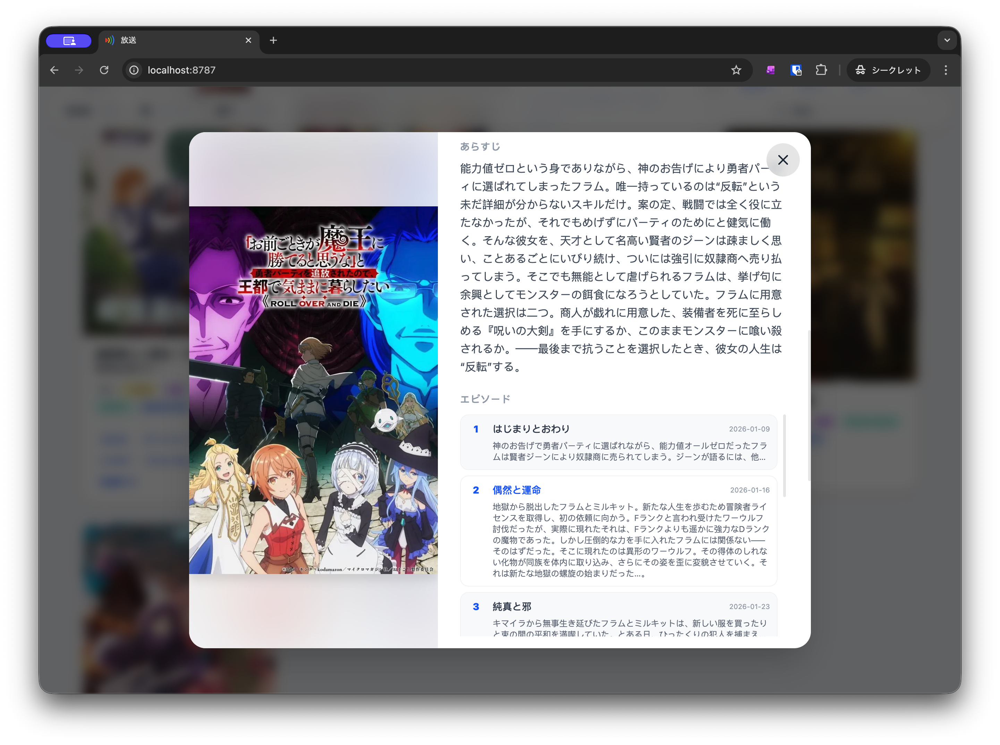

# Housou (放送)

[](https://deploy.workers.cloudflare.com/?url=https://github.com/Asutorufa/housou)

**Housou (放送)** is a high-performance, modern web application for tracking anime broadcast schedules. Built with a **Rust-based backend** deployed on **Cloudflare Workers** and a fluid **React frontend**, it provides a seamless experience for discovering what's airing now and where to watch it.

Leveraging curated data from [bangumi-data](https://github.com/bangumi-data/bangumi-data), Housou automatically enriches schedules with high-quality metadata from **TMDb** and **AniList**, ensuring you always have access to the latest cast, staff, and episode details.

## Features

- 📅 **Weekly Schedule**: Fluid day-of-week navigation with grid view.
- 🔍 **Smart Filtering**: Filter by year, season, and streaming platform.
- 🎭 **Rich Metadata**: Automatically fetches cast, staff, and episodes from TMDb or AniList.
- ⚡ **Edge-Optimized**: Serverless architecture using Cloudflare Workers and Rust (Wasm).
- 🗄️ **Intelligent Caching**: Adaptive caching logic (7 days for ongoing, 30 days for finished titles).
- 🌙 **Modern Design**: Responsive UI with automatic dark mode and smooth animations.

## Screenshots

| Home Page | Details Modal |
| :---: | :---: |
|  |  |

## Environment Variables

Create `.dev.vars` for local development:

```bash
TMDB_TOKEN=your_tmdb_api_token
```

For production, set the secret via Wrangler:

```bash
npx wrangler secret put TMDB_TOKEN
```

## Local Development

```bash
# Install web dependencies
cd web && npm install && cd ..

# Start dev server
npx wrangler dev
```

## Manual Deploy

```bash
# Build the frontend
cd web && npm run build && cd ..

# Deploy to Cloudflare
npx wrangler deploy
```

## Project Structure

```text
├── src/
│   ├── lib.rs           # Worker entry + Router
│   ├── model.rs         # Shared data models
│   ├── provider.rs      # Metadata provider orchestration
│   └── provider/
│       ├── tmdb.rs      # TMDb (Movie Database) integration
│       └── anilist.rs   # AniList GraphQL integration
├── web/
│   ├── src/
│   │   ├── App.tsx              # Main entry point
│   │   └── components/
│   │       ├── AnimeCard.tsx    # Card component with layout animations
│   │       ├── DetailsModal.tsx # Comprehensive info popup
│   │       ├── Header.tsx       # Navigation and filters
│   │       ├── TabbedGrid.tsx   # Schedule tabs and layout
│   │       ├── Footer.tsx       # Site-wide footer
│   │       └── AttributionModal.tsx # Data source attribution
├── wrangler.toml        # Cloudflare Workers configuration
└── Cargo.toml           # Rust/Wasm dependencies
```

## API Endpoints

### `GET /api/config`
Retrieve site metadata (streaming platforms), available years, and attribution info.

### `GET /api/items`
Fetch anime list for a specific season.
- `year` (required): The year (e.g., `2025`).
- `season` (optional): `Winter`, `Spring`, `Summer`, `Autumn`.

### `GET /api/metadata`
Fetch detailed metadata for a specific title.
- `tmdb_id` (optional): TMDb ID for direct lookup.
- `title` (optional): Anime title for search fallback.
- `begin` (optional): Start date (ISO format) to refine search.

## License

MIT
