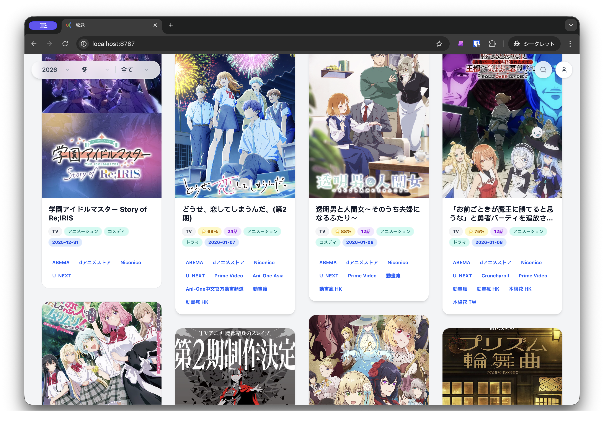
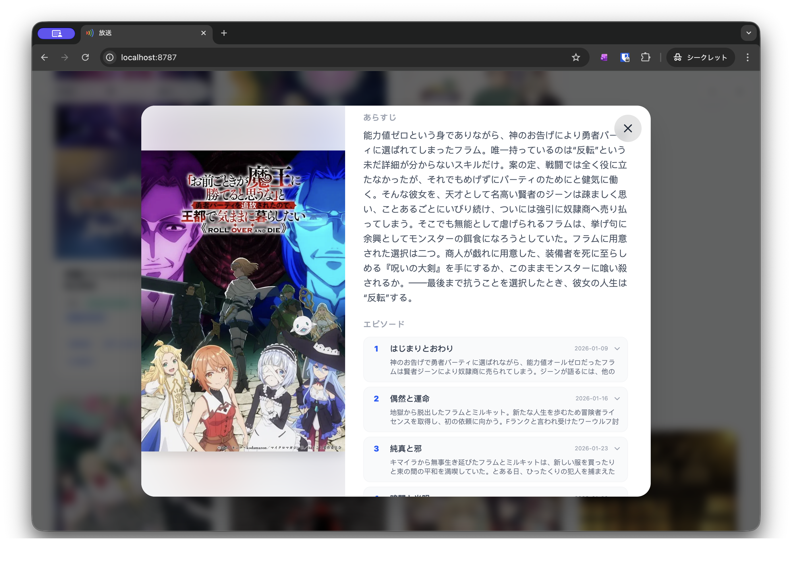

# Housou (放送)

[](https://deploy.workers.cloudflare.com/?url=https://github.com/Asutorufa/housou)

**Housou (放送)** is a high-performance, modern web application for tracking anime broadcast schedules. Built with a **Rust-based backend** deployed on **Cloudflare Workers** and a fluid **React frontend**, it provides a seamless experience for discovering what's airing now and where to watch it.

Leveraging curated data from [bangumi-data](https://github.com/bangumi-data/bangumi-data), Housou automatically enriches schedules with high-quality metadata from **TMDb**, **AniList**, and **MyAnimeList (Jikan)**, ensuring you always have access to the latest cast, staff, and episode details.

## Features

- 📅 **Weekly Schedule**: Fluid day-of-week navigation with grid view.
- 🔍 **Smart Filtering**: Filter by year, season, and streaming platform.
- 🎭 **Rich Metadata**: Automatically fetches cast, staff, and episodes from **TMDb**, **AniList**, or **MyAnimeList (via Jikan)**.
- ⚡ **Edge-Optimized**: Serverless architecture using Cloudflare Workers and Rust (Wasm).
- 🗄️ **Intelligent Caching**: Adaptive caching logic (7 days for ongoing, 30 days for finished titles).
- 📅 **Future Schedules**: Automatically switches to **Jikan API** for future or newly announced seasons not yet in bangumi-data.
- 🌙 **Modern Design**: Responsive UI with automatic dark mode and smooth animations.
- 🔑 **Secure Auth**: Support for GitHub OAuth and Passkeys (WebAuthn).

## Screenshots

<div align="center">
  
  <p><i>Fluid Weekly Schedule</i></p>
  <br/>
  
  <p><i>Rich Metadata Details</i></p>
</div>

## Environment Variables

Create `.dev.vars` for local development. For production, use `npx wrangler secret put <NAME>`.

| Variable | Description | Required |
| :--- | :--- | :--- |
| `TMDB_TOKEN` | TMDb API Read Access Token (v4). | Yes |
| `BASE_URL` | The base URL of your application (e.g., `https://housou.pages.dev`). | No* |
| `GITHUB_CLIENT_ID` | GitHub OAuth App Client ID. | For Auth |
| `GITHUB_CLIENT_SECRET` | GitHub OAuth App Client Secret. | For Auth |
| `CORS_ALLOWED_ORIGIN` | Allowed origin for CORS (default: `*`). | No |

*\* Defaults to `http://localhost:8787` if not set.*

## Local Development

```bash
# 1. Install dependencies
npm install
cd web && npm install && cd ..

# 2. Configure secrets
echo "TMDB_TOKEN=your_token_here" > .dev.vars

# 3. Start dev server
npx wrangler dev
```

## Authentication & Database

Housou supports optional user accounts for tracking watch status (Watching, Completed, etc.). This feature requires a Cloudflare D1 database.

### 1. Create D1 Database

```bash
npx wrangler d1 create housou-db
```

Update `wrangler.toml` with your `database_id`:

```toml
[[d1_databases]]
binding = "DB"
database_name = "housou-db"
database_id = "xxxx-xxxx-xxxx"
```

### 2. Configure GitHub OAuth

To enable GitHub login:

1.  Go to **GitHub Settings** > **Developer settings** > **OAuth Apps** > **New OAuth App**.
2.  Set **Homepage URL** to your application's domain (e.g., `https://housou.pages.dev`).
3.  Set **Authorization callback URL** to `{BASE_URL}/api/auth/github/callback`.
4.  Generate a **Client Secret**.
5.  Add the ID and Secret to your environment:
    ```bash
    npx wrangler secret put GITHUB_CLIENT_ID
    npx wrangler secret put GITHUB_CLIENT_SECRET
    ```

### 3. Passkey Support (WebAuthn)

Once logged in via GitHub, users can register Passkeys (TouchID, FaceID, Yubikey) for faster, passwordless logins on subsequent visits. This is handled via the `/api/auth/passkey/*` endpoints.

## API Endpoints

### Core API

| Endpoint | Method | Description |
| :--- | :--- | :--- |
| `/api/config` | `GET` | Site config, streaming services, and attribution. |
| `/api/items` | `GET` | List anime for a specific year/season (Bangumi-data / Jikan). |
| `/api/metadata` | `GET/POST` | Detailed metadata for a specific title (TMDB/AniList/MAL). |

### Authentication

| Endpoint | Method | Description |
| :--- | :--- | :--- |
| `/api/auth/me` | `GET` | Get current authenticated user info. |
| `/api/auth/register` | `POST` | Register a new user with email/password. |
| `/api/auth/login` | `POST` | Login with email/password. |
| `/api/auth/logout` | `POST` | Log out and clear session. |
| `/api/auth/profile` | `PUT` | Update user profile (username, avatar). |
| `/api/auth/password` | `PUT` | Change user password. |

### GitHub OAuth

| Endpoint | Method | Description |
| :--- | :--- | :--- |
| `/api/auth/github/authorize` | `GET` | Start GitHub OAuth flow. |
| `/api/auth/github/callback` | `GET` | GitHub OAuth callback handler. |
| `/api/auth/github/bind` | `GET` | Link GitHub account to current user. |
| `/api/auth/github` | `DELETE` | Unlink GitHub account. |

### Passkeys (WebAuthn)

| Endpoint | Method | Description |
| :--- | :--- | :--- |
| `/api/auth/passkey/register/*` | `POST` | Register a new Passkey (Start/Finish). |
| `/api/auth/passkey/login/*` | `POST` | Login with a Passkey (Start/Finish). |
| `/api/auth/passkey` | `GET` | List user's registered Passkeys. |
| `/api/auth/passkey` | `DELETE` | Delete a Passkey. |
| `/api/auth/passkey` | `PATCH` | Rename a Passkey. |

### User Data

| Endpoint | Method | Description |
| :--- | :--- | :--- |
| `/api/user/item` | `GET` | Get watch status and score for a specific title. |
| `/api/user/item` | `POST` | Update watch status and score for a title. |
| `/api/user/status` | `POST` | Update simple watch status. |

## Project Structure

- `src/`: Rust backend (Cloudflare Worker).
  - `auth/`: Authentication logic (GitHub OAuth, Passkeys).
  - `provider/`: Metadata integrations (TMDb, AniList, Jikan).
- `web/`: React frontend (Vite + Radix UI + Framer Motion).

## License

MIT
